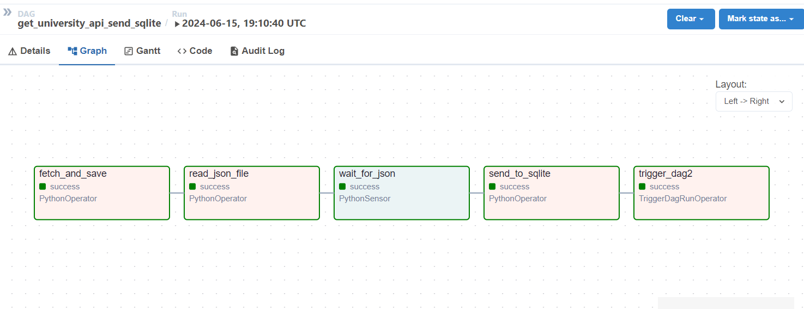
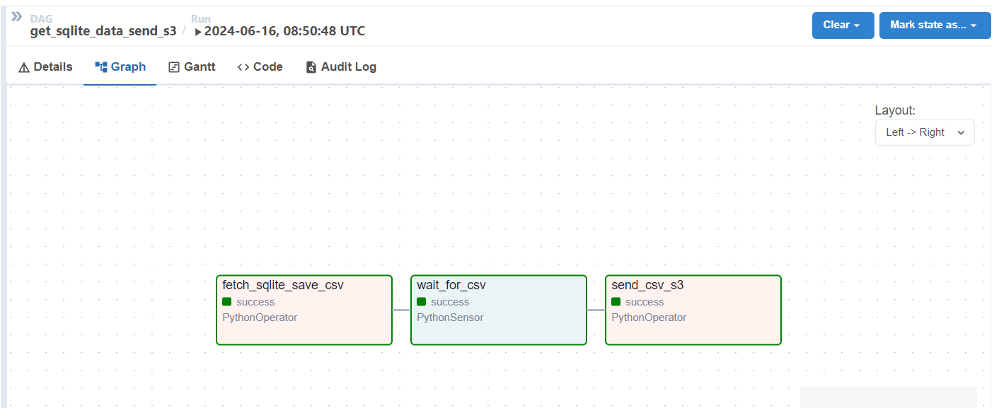

### End to End Data Engineering project using Apache Airflow and AWS Crawler, AWS Glue, and Amazon Athena

In this project, I built an ETL pipeline using Apache Airflow. The result was stored in a Sqlite database. After that, I uploaded the data to AWS S3 and used Amazon Athena to run queries on the CSV file by adding a Crawler. There were two DAGs in this project. The first one fetched data from an API and sent it to Sqlite. Once the data was sent to Sqlite, a trigger mechanism activated DAG 2. DAG 2 then retrieved data from Sqlite and uploaded it to an S3 bucket as a CSV file.

#### DAG 1: get_university_api_send_sqlite

#### DAG 2: get_sqlite_data_send_s3

